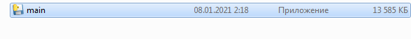
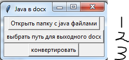

###Утилита перевода Java файлов в docx
___
Небольшой туториал

В папке output скомпиленный экзешник клацаем по нему

1. выбираем папку где лежат java исходники 
2. выбираем выходное имя docx файла
3. конвертируем
4. PROFIT!!!!!

